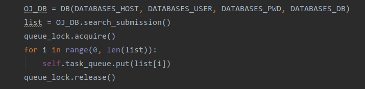

# Judger API

## Introduction

A sandbox of judger. With the input solution_id, the judger would return the result of the code according to this solution_id.

The judger is implemented using python with django.

## Principle

The total working steps of the judger can be separated into 5 parts: searching information, output code as a file, compile code, run code and compare output. 

### Searching information

The judger client maintains a queue of `solution_id`. With something in the queue, the judger would automatically search the database in order to get all the information needed. If the queue is empty, the judger would search the database to prevent some submission from mission. 

### Output, compile and run

Because the code is stored in database and it is almost impossible to compile a string, we have to output the code string got from the database to a file. After outputting the string, the judger would call the system command to compile and run the code. 

### Compare user output with the standard output

There are two kinds of circumstance in this step: ordinary judge and special judge. It is easy to implement the ordinary judge with the I/O operation. For the special judge, a `spj.cc` code is needed. The contrast is done by the `spj.cc`. The only one thing the judger should do is to compile and run the `spj.cc`. The return value of the `spj.cc` determine the correctness of the user output.

## Difficulty

#### How to prevent the server from being attacked by some malicious code like os.system('rm -rf /*')?

Using docker. The docker container would bear most of the attack from malicious code. 

#### How to judge the TLE and MLE?

For TLE, it is useful to run the code with a thread. Before the code running, the timeoutThread would be started. In the timeoutThread, it would judge whether time out. 

For MLE, it is useful to run the code with a process. We can easily get a memory occupation with some system command in Linux. However, in python, there is a powerful package could be helpful, which is `psutil`. It can easily get all of the information with a pid. So, in the docker, the judger would start a process and a listener listening to the process and return the corresponding result.

