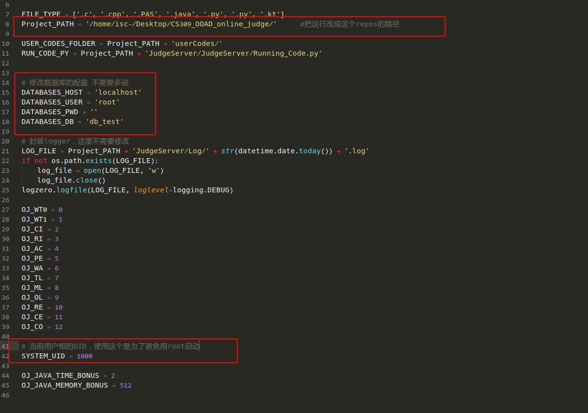
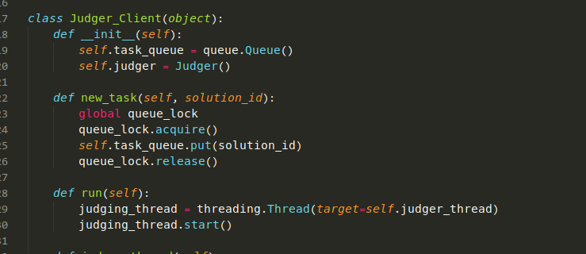
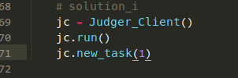

## 在config里面需要配置的东西：

## 需要导入的包

import logzero

import datetime

import logging

import threading

import time

import psutil

import pymysql

import queue

## 接口

暂时只开放了两个接口

用法如下

前两行是开启了一个评测机线程，

第三行是往评测机线程中丢入评测项目

但是这个感觉不太好

目前想法是更新为开启评测机进程

然后后端跟judger用消息队列通信