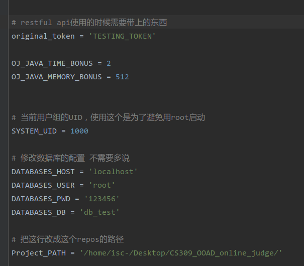

## 在config里面需要配置的东西：



## 需要导入的包

import datetime

import flask

import hashlib

import logzero

import logging

import socket

import psutil

import pymysql

import queue

import threading

import time


## 接口

所有的request都用POST的形式，其他形式不被接受

所有的request都需要带上一个header, 格式如下

```json
{
	'Cs309-Token': sha256(token)
}
```


### start

request:  `/api/start/`

不需要带data


### new_task

request: `/api/judge/`

```
{
	'solution_id': 给个id， string or int 应该都可以
}
```

注意本接口调用之前必须先调用start